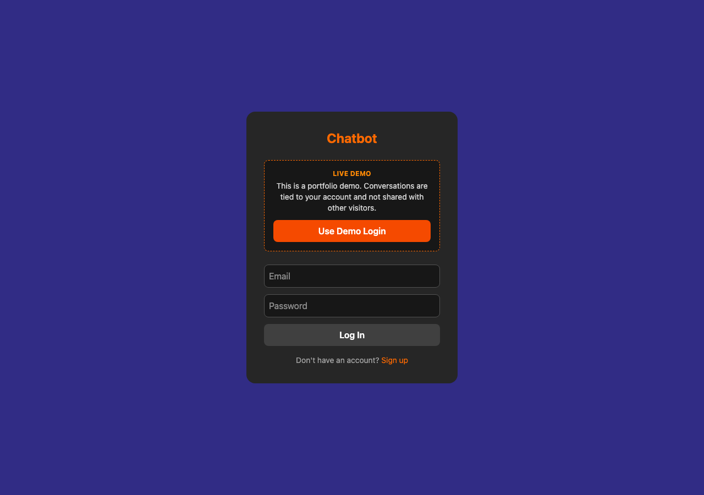

# Chatbot

A ChatGPT-style chat UI built with React, Tailwind CSS, and the
[Groq API](https://groq.com/) (Llama 3.3 70B). Conversations are tied to a
user account and persisted through a backend API.




**Live demo:** [akdev-chatbot.netlify.app](https://akdev-chatbot.netlify.app)

**Test Credentials:**
- **Demo:** `demo@test.com` / `demo1234` (or use the "Use Demo Login" button)

> 📌 **Note:** This is a portfolio/demo project. All data is for testing purposes only. Please don't enter real personal information.

## Features

- Send prompts and get AI responses (Groq `llama-3.3-70b-versatile`)
- User accounts: sign up, log in, or use the one-click demo login
- Each account has its own chats, other users can't see or touch them
- Sidebar of past conversations for the logged-in user: select, create, or delete a chat
- Chat history persisted via a backend API (create/get/update/delete)

## Tech Stack

React 19, Vite, Tailwind CSS v4, Axios.

## Setup

This app needs a running backend to work against: it handles auth, chat
persistence, and proxies the actual Groq calls, so the frontend never talks
to Groq directly or needs an API key of its own. See
[chatbot-backend](https://github.com/alikirat/chatbot-backend).

1. Create a `.env` file in the project root:
   ```env
   VITE_API_URL=http://localhost:3000
   ```
2. Install and run:
   ```bash
   npm install
   npm run dev
   ```

The app runs on `http://localhost:5173` by default.

## Notes

AI responses are generated by calling the backend's `/api/chat/completion`,
which proxies the request to Groq server-side. The Groq API key lives only
in the backend's environment and never reaches the browser.
